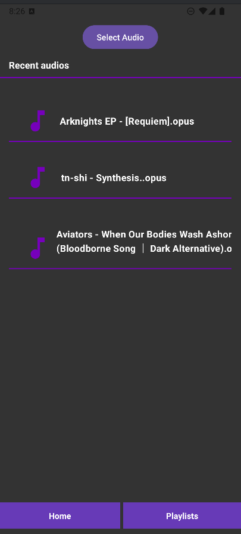
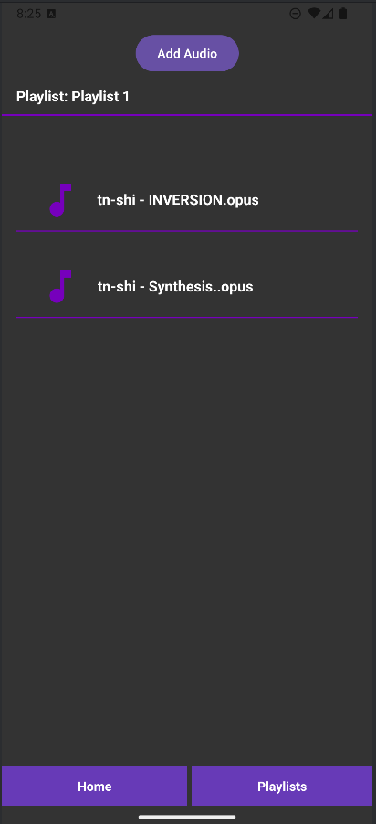

# Music Player App

Welcome to my Music Player App! Here's what you can do with it:

## Features

- **Play Music**: Enjoy your favorite tracks with an easy-to-use interface.
  - Browse through your music library.
  - Play, pause, and navigate through songs effortlessly.

- **Create Playlists**: Organize your music the way you like.
  - Add, remove, and manage songs within playlists.
  - Save your custom playlists for later enjoyment.
  - 
- **Listen music while the app is on the background**

## How to Use

1. **Browse Your Library**: Start by exploring your music collection within the app.
2. **Play a Song**: Select any song to start listening.
3. **Create a Playlist**: 
   - Click on the 'Create Playlist' button.
   - Name your playlist and add songs from your library.
4. **Manage Playlists**: 
   - Edit playlists by adding or removing songs.
   - Play entire playlists with one tap.

## Images
**Home Page**

**Playlist Page**

**Playlist Song Page**

## License

This project is open source under the [MIT License](LICENSE).

---

Happy listening!
